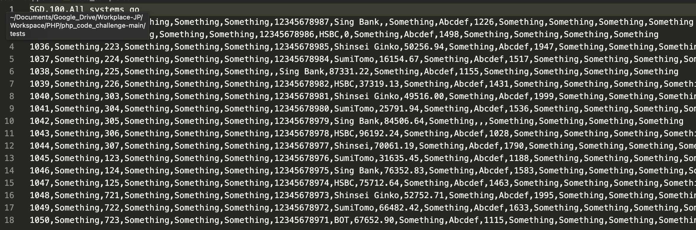
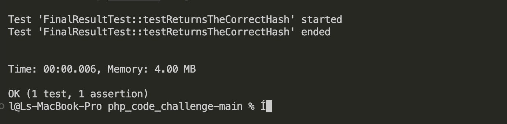

# Documentation #

## Input file for testing

data_sample.csv

## Result of test

Run `./vendor/bin/phpunit tests`

## Modification

### Create new classes
New classes like Reader, Signleton, Parser, SampleParserimpl are created. Each class was created for one responsibility.  This could achieve resubility and maintenance.

### Create a parser interface
Given that *this is from a larger application that handles multiple files, multiple banks, mutiple countries, and multiple currencies.*, I assumed the FinalResult generated from different files are be the same. I created an Parser interface so that all protential client must implemenet the interface methods in advance. This creation also allowed decoupling in design.

### Create a singleton for the CSV reader
I created a singleton to ensure that the reader class had just a single instance and provided a global access point to that instance. It could reduce memory usage when initializing the Reader object.

## No change
- SamplePaserimpl: there was no change in the implementation of its methods because the original implementation already passed the test case. 